# 🛒 Ecommerce Version 01

> **From Course Project to Modern Full-Stack Application**


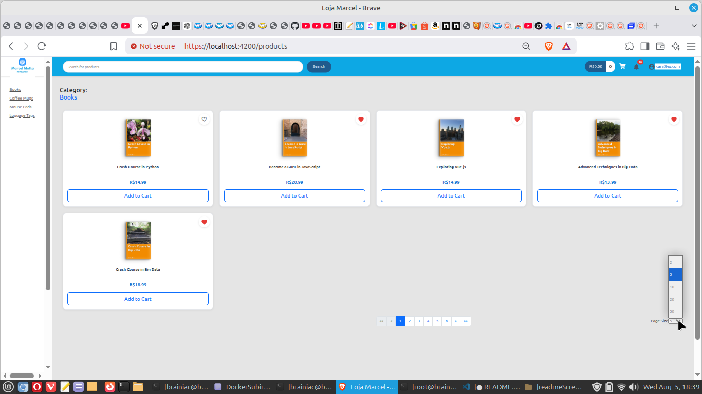

A modern full-stack e-commerce platform built with Angular 20, Spring Boot 3, Docker, and Mercado Pago Checkout Pro integration.

Originally based on a 2020 Angular + Spring Boot course, the project has evolved into a significantly enhanced application featuring modern Angular architecture, JWT authentication, WebSocket notifications, Docker-based development, cloud deployment, multiple database profiles, and Mercado Pago Checkout Pro integration.


## About

This project started as a personal learning exercise based on an Angular + Spring Boot Udemy course released around 2020.

Instead of simply reproducing the course, the application was progressively modernized and extended with new technologies, architectural improvements, and production-oriented features.

The current implementation includes:

- Angular 20
- Spring Boot 3
- JWT Authentication
- WebSocket Notifications
- Mercado Pago Checkout Pro
- Docker Compose
- MySQL, PostgreSQL and H2 support
- Render deployment
- Responsive user interface
- Administrative dashboard
- Git


## From Course Project to Modern Full-Stack Application

This project started as a learning exercise based on an Angular + Spring Boot Udemy course originally released around 2020.

Over time, it evolved far beyond the original scope through continuous modernization, architectural improvements, and the implementation of new features. The goal was not only to learn new technologies but also to gain practical experience maintaining, refactoring, and extending an existing codebase.

### Original Project

- Angular 10
- Spring Boot
- Bootstrap
- MySQL
- Basic e-commerce features

### Frontend Modernization

- Upgraded from Angular 10 to Angular 20
- Refactored deprecated Angular APIs
- Improved TypeScript compatibility
- Introduced Angular Material components while preserving Bootstrap
- Centralized REST API endpoints
- Automatic environment detection (Local Network / Render)
- Responsive layout for desktop and mobile devices
- Improved application structure and maintainability


### Backend Evolution

- JWT Authentication
- WebSocket support
- WebSocket authentication
- Notification system
- Mercado Pago Checkout Pro integration
- Improved payment webhook processing
- Environment variable configuration

### Infrastructure Evolution

- Docker Compose
- H2 development profile
- PostgreSQL migration for Render deployment
- Local MySQL environment maintained for development
- ngrok integration for local Mercado Pago webhook testing


## Features

### Customer Area

- User registration and authentication
- Product catalog
- Product search
- Shopping cart
- Checkout
- Mercado Pago Checkout Pro
- Favorites (Wishlist)
- Customer profile
- Multiple addresses
- Order history
- Real-time notifications
- Responsive interface for mobile devices

### Administrator Area

The original Udemy project did not include an administrative module.

A dedicated administration area was designed and implemented with its own authentication flow.

Main features include:

- Administrator login
- Dashboard
- Product management
- Category management
- Customer management
- Order management
- Charts and business metrics


## Project Highlights
- Angular 20
- Spring Boot 3
- JWT Authentication
- Docker Compose
- Mercado Pago Checkout Pro
- WebSocket Notifications
- Three Database Profiles
- Admin Dashboard
- Cloud Deployment


## Technology Stack

### Frontend
- Angular 20
- TypeScript
- Angular Material
- Bootstrap
- RxJS
- HTML5
- CSS3

### Backend
- Java 17
- Spring Boot 3
- Spring Security
- Spring Data JPA
- Hibernate
- JWT Authentication
- WebSocket (STOMP)

### Databases
- MySQL
- PostgreSQL
- H2

### Payments
- Mercado Pago Checkout Pro
- Webhooks
- ngrok

### Infrastructure
- Linux Mint (Development Environment)
- Docker
- Docker Compose
- Render

### Development Tools
- IntelliJ IDEA
- Visual Studio Code
- Docker
- Docker Compose
- Postman
- cURL
- MySQL Workbench
- pgAdmin 4
- Git
- GitHub
- GitHub Actions (planned for future versions)
- ngrok

### Developer Utilities

The repository also includes helper shell scripts used during development to simplify API testing and administrative operations through cURL.

## Application Architecture

The application follows a layered architecture, separating responsibilities between the frontend, backend, persistence layer, and external services.

### High-Level Architecture

#### Local Development Environment

```text
Angular 20
     │
     │ REST API
     ▼
Spring Boot 3
     │
     ├── Service Layer
     │       │
     │       ▼
     │   Spring Data JPA
     │       │
     │       ▼
     │      MySQL
     │
     └── Mercado Pago Checkout Pro
             │
             ▼
        Mercado Pago API
             │
             │ Webhook through ngrok
             ▼
        Spring Boot 3
```

#### Render Deployment

```text
Angular 20
     │
     │ REST API
     ▼
Spring Boot 3
     │
     ├── Service Layer
     │       │
     │       ▼
     │   Spring Data JPA
     │       │
     │       ▼
     │   PostgreSQL
     │
     └── No Mercado Pago integration in this deployed version
```
The application was first deployed to Render using PostgreSQL, before the Mercado Pago integration was implemented. Payment integration and webhook testing were later developed in the local Docker environment using MySQL and ngrok.

### Backend

The backend follows a layered architecture based on Spring Boot.

- REST Controllers
- Service Layer
- Repository Layer
- Persistence Layer

Main configuration classes:
- SecurityConfig
- WebConfig
- WebSocketConfig
- WebSocketAuthChannelInterceptor

### Frontend

The frontend was refactored to improve maintainability and reduce duplicated configuration.

Key architectural decisions include:

- Centralized REST API endpoints
- Automatic environment detection (localhost, private network, and Render)
- Dynamic API and WebSocket configuration
- Angular Services
- Route Guards
- HTTP Interceptors
- RxJS Observables
- Angular Material
- Bootstrap

## Infrastructure Evolution

The infrastructure evolved throughout the project as new requirements emerged.

### Phase 1 – Local Development

- Angular 20
- Spring Boot 3
- Docker Compose
- MySQL

### Phase 2 – Cloud Deployment

Before the payment integration was implemented, the application was deployed to Render.

Infrastructure used:

- Angular 20 Frontend
- Spring Boot 3 Backend
- PostgreSQL
- Render Static Site
- Render Web Service

### Phase 3 – Payment Integration

To support Mercado Pago Checkout Pro and webhook development, the project returned to a local Docker-based environment.

Infrastructure used:

- Angular 20 Frontend
- Spring Boot 3 Backend
- Docker Compose
- MySQL
- ngrok
- Mercado Pago Sandbox

## Development Environment

The project was primarily developed on Linux Mint, providing a stable and productive environment for Java, Angular, Docker, and database development.

Docker-based containers were used throughout the project to ensure a consistent local development environment while keeping the application portable across different operating systems and deployment platforms.

### Mobile Testing

- Android smartphone
- Local HTTPS frontend
- Local Docker backend
- Responsive layout validation

### Operating System

- Linux Mint (Daily development environment)

### IDEs and Editors

- IntelliJ IDEA
- Visual Studio Code

### Database Tools

- MySQL Workbench
- pgAdmin 4

### API and Testing

- Postman
- cURL

### Containerization

- Docker
- Docker Compose

### Cloud & Networking

- Render
- ngrok

### Version Control

- Git
- GitHub

## Technical Challenges

Developing this application involved several technical challenges beyond implementing business features.

Some of the most relevant challenges included:

- Angular 10 → Angular 20 migration.
- Mercado Pago Checkout Pro integration.
- Webhook synchronization.
- Docker-based development.
- PostgreSQL deployment on Render.
- ngrok for local webhook testing.

## Design Decisions

Some important architectural decisions made during the project include:

- Centralized API endpoint configuration.
- Environment-based application configuration.
- Docker for reproducible development environments.
- Layered backend architecture.
- WebSocket-based real-time notifications.
- Server-side payment validation.
- Separation between cloud deployment and local payment integration.

## Future Improvements

- Complete Pix validation in production.
- GitHub Actions CI/CD
- Automated integration tests.
- Expanded admin analytics.
- Social login (Google)


## Lessons Learned

During the development of this project I gained practical experience with:

- Angular modernization
- Spring Boot REST APIs
- JWT authentication
- WebSocket communication
- Docker-based development
- Cloud deployment with Render
- MySQL and PostgreSQL
- Mercado Pago Checkout Pro
- Payment webhooks
- Environment-based configuration
- Maintaining and extending an existing codebase
- Software architecture documentation
- Cloud deployment strategies
- Secure payment integration
- Responsive application design and cross-device testing


## Mercado Pago Integration

The application integrates Mercado Pago Checkout Pro to provide a secure online payment experience.

The payment flow was designed to keep all sensitive payment information on Mercado Pago servers while the backend is responsible for creating payment preferences, validating payment notifications, and synchronizing order status.

### Integration Highlights

- Checkout Pro integration
- Server-side payment preference creation
- Order validation before payment creation
- Secure amount validation using database values
- Mercado Pago Webhook processing
- Idempotent payment synchronization
- Environment variable configuration
- Local webhook testing with ngrok

### Architecture

The payment integration follows a server-side architecture where payment preferences are created by the backend and all payment notifications are processed asynchronously through Mercado Pago webhooks.

The frontend never communicates directly with Mercado Pago APIs other than being redirected to Checkout Pro.

### Payment Flow

Customer

↓

Angular Checkout

↓

Spring Boot

↓

Create Payment Preference

↓

Mercado Pago Checkout Pro

↓

Customer completes payment

↓

Mercado Pago Webhook

↓

Spring Boot

↓

Order Update

↓

Database

### Security Considerations

Several measures were implemented to improve payment security:

- Payment amounts are always obtained from the database.
- The frontend never defines the payment amount.
- Orders already marked as paid cannot generate new payment preferences.
- Existing payment preferences cannot be recreated.
- Webhook notifications are processed in an idempotent manner to avoid duplicate updates.


### Testing

The payment integration was validated using the Mercado Pago Sandbox environment.

Tests included:

- Credit card payments
- Boleto payments
- Pending payments
- Approved payments
- Repeated webhook notifications
- Local webhook testing through ngrok

During development, some inconsistencies were observed in the Mercado Pago Sandbox environment, particularly when testing credit card payments. These scenarios were documented as part of the project's integration experience.


## Running Locally

### Requirements

- Java 17
- Node.js
- Docker
- Docker Compose

### Clone

```bash
git clone https://github.com/MarcelMotta-J/Ecommerce-version-01.git

cd Ecommerce-version-01
```

### Environment Variables

Create a `.env` file with:

```text
JWT_SECRET=
MERCADO_PAGO_ACCESS_TOKEN=
MERCADO_PAGO_NOTIFICATION_URL=
APP_FRONTEND_URL=
```

Example:

```text
JWT_SECRET=your-secret
MERCADO_PAGO_ACCESS_TOKEN=APP_USR-...
MERCADO_PAGO_NOTIFICATION_URL=https://xxxx.ngrok-free.app/api/payments/webhook
APP_FRONTEND_URL=https://localhost:4200
```


### Start

```bash
docker compose -f compose.dev.yaml up --build

docker compose -f compose.dev.yaml up -d --build
```

## Screenshots

### Customer Authentication

| Customer Login | Customer Registration |
|----------------|-----------------------|
| 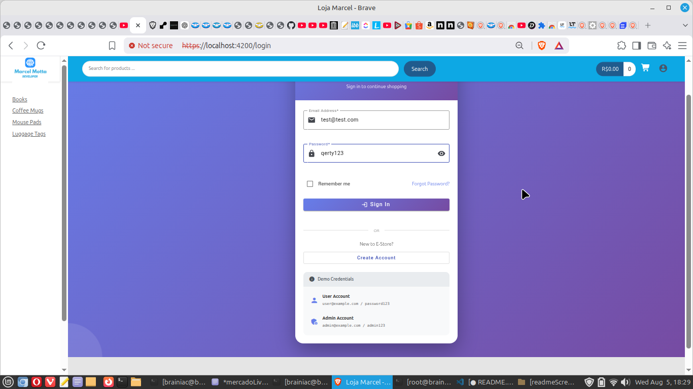 | 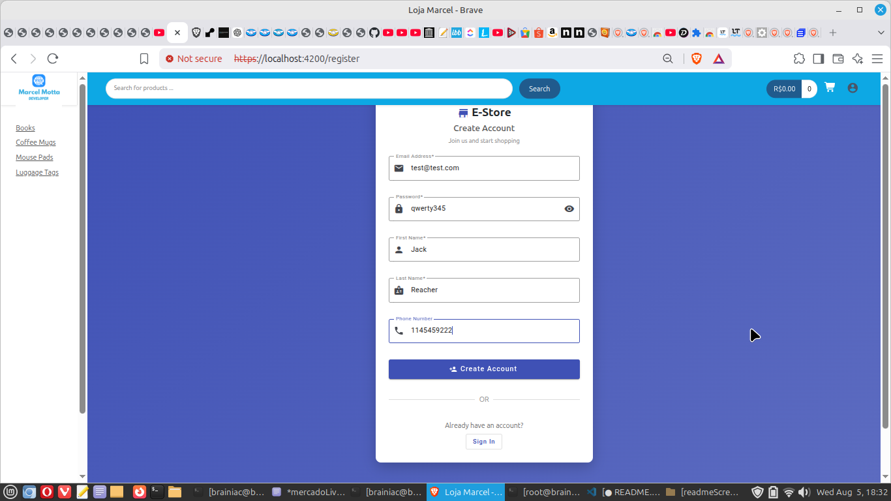 |

### Shopping Experience

| Home | Product Catalog |
|------|-----------------|
|  | 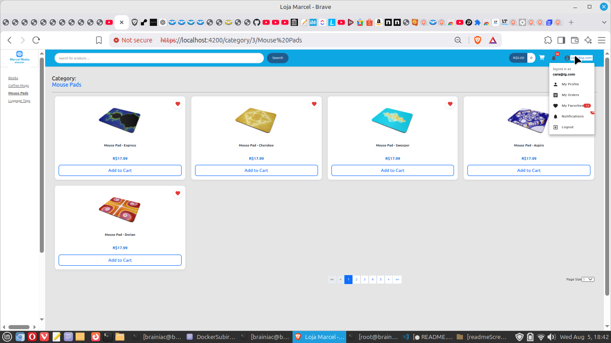 |

| Favorites | Checkout |
|-----------|----------|
| 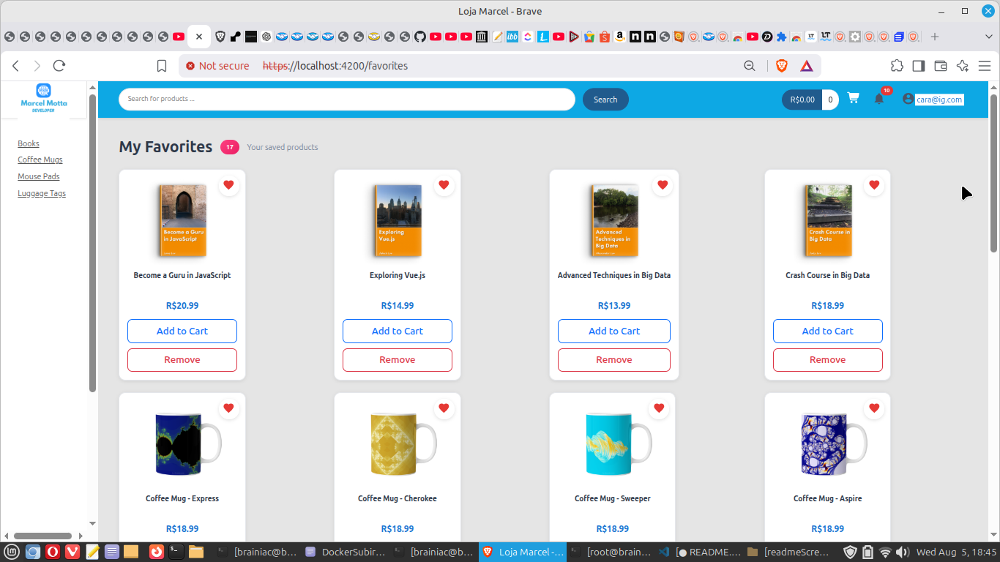 | 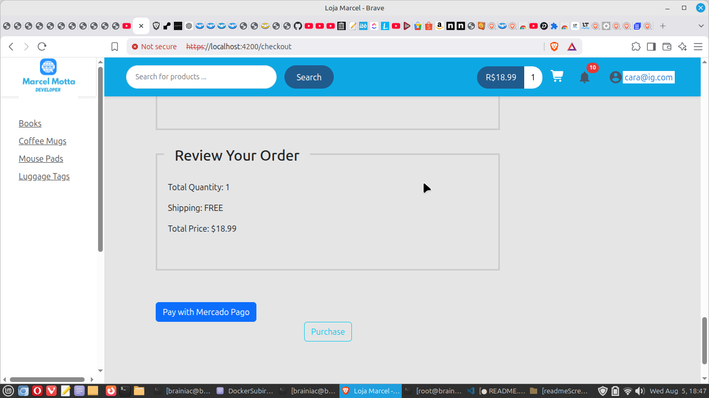 |

### Payments

| Mercado Pago Checkout | Successful Sandbox Payment |
|-----------------------|----------------------------|
| 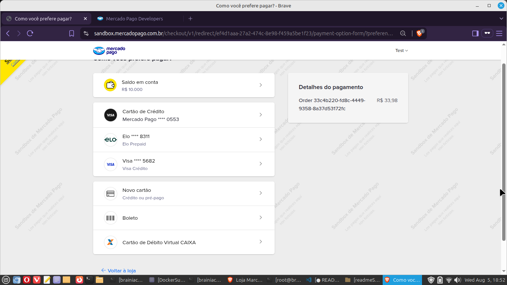 | 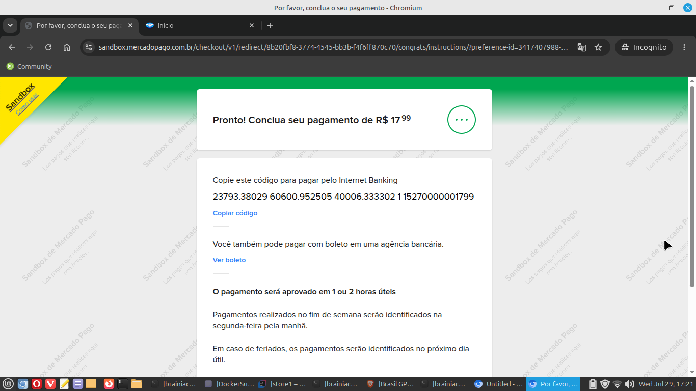 |

### Customer Area

| Profile | Orders |
|---------|--------|
| 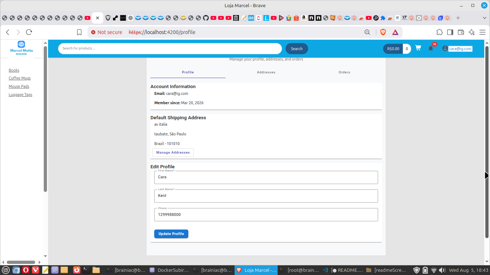 | 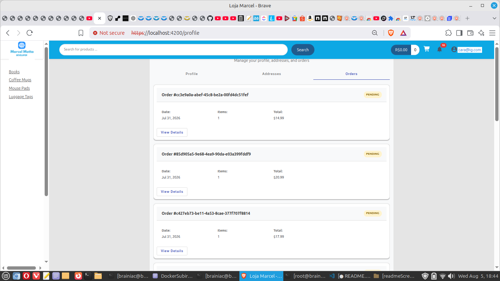 |

| Notifications |
|---------------|
| 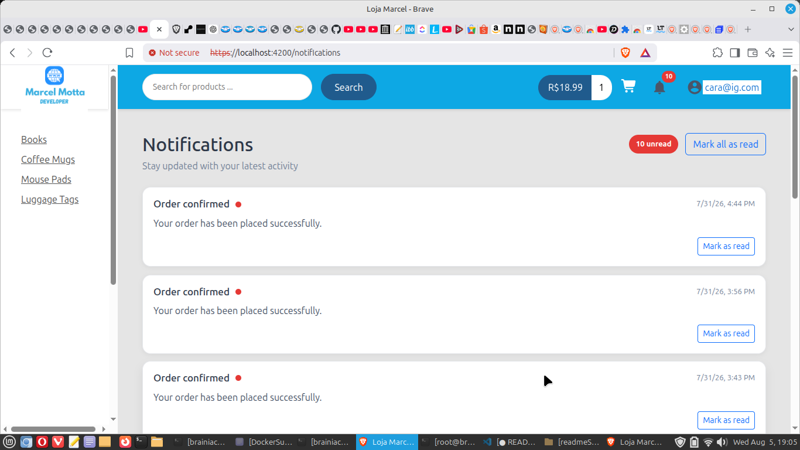 |

### Administration

| Administrator Login | Admin Dashboard |
|---------------------|-----------------|
| 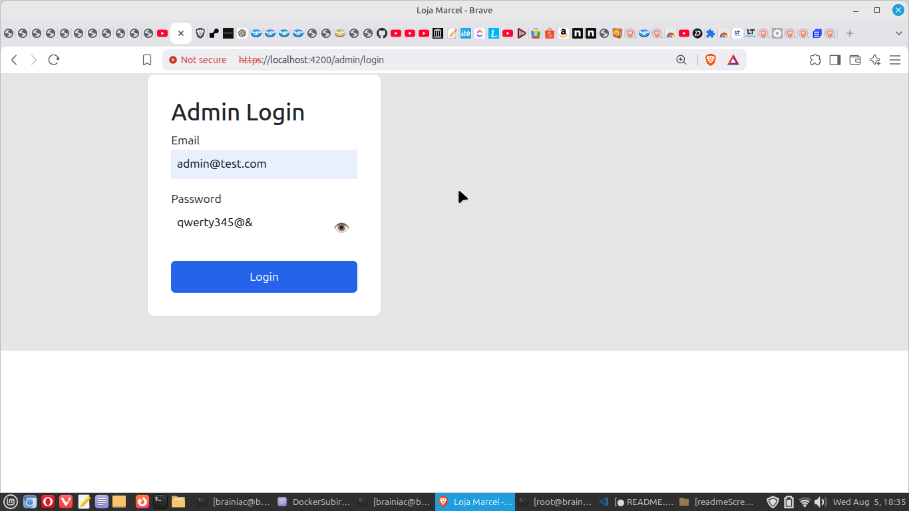 | 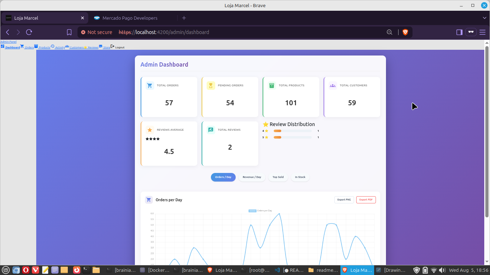 |

### Responsive Design

| Desktop | Mobile |
|---------|--------|
|  | 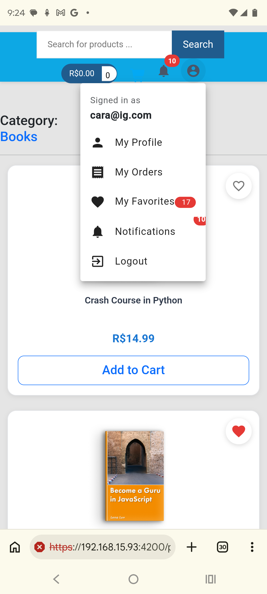 |


## Acknowledgements

This project was originally inspired by an Angular + Spring Boot Udemy course and was significantly extended and modernized through continuous learning and independent development.


## Project Timeline

| Year / Phase | Milestone |
|--------------|-----------|
| 2020 | Original Angular + Spring Boot Udemy Course |
| Phase 1 | Angular 20 Modernization |
| Phase 2 | JWT Authentication |
| Phase 3 | Administrator Dashboard |
| Phase 4 | Docker Environment |
| Phase 5 | Render Deployment |
| Phase 6 | Mercado Pago Checkout Pro |
| Final | Documentation & Portfolio |